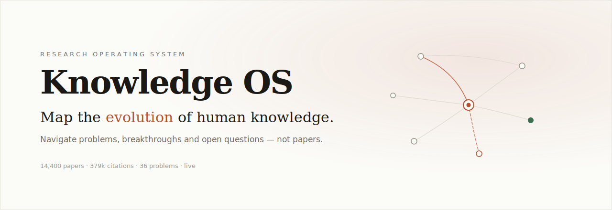

<div align="center">



<p>
  <a href="https://evolve-snowy.vercel.app/"></a>
  
  
  
  
  
  
</p>

<p><b><a href="https://evolve-snowy.vercel.app/">Live demo</a></b> · <a href="#quickstart">Quickstart</a> · <a href="#how-it-works">How it works</a> · <a href="DEPLOY.md">Deploy</a></p>

</div>

---

Research tools give you papers. Knowledge OS gives you the **problem** — how it evolved, what was
tried, what failed, what won, and what's still open. You browse an actual map of a field instead of
a list of PDFs.

It runs on real data: **14,400 papers and ~379k citations** from OpenAlex, organized into 36
computer-science problems and the sub-problems hiding inside them. The whole thing is static and
client-side — no backend, no database at runtime, no API keys, nothing to bill.

## Features

- **Problem-first navigation.** Browse fields as problems ranked by momentum, not as folders of papers.
- **Evolution at a glance.** Per-problem timelines, breakthrough papers, the recent frontier, and key researchers — all computed from the citation graph.
- **Ask anything (`⌘K`).** "How did distributed consensus evolve?" "Who works on cryptography?" A retrieval agent answers with cited evidence. Runs in the browser; no LLM bill.
- **Knowledge graph.** Every problem a node, citation flow the edges. Hover to trace, click to open.
- **AI Scientist.** Surfaces bridge opportunities (fields whose researchers overlap but whose papers don't cite each other) and emerging frontiers. It refuses to invent contradictions it can't ground.
- **The canon.** "Papers that mattered," Turing to AlphaFold, with live citation counts.

## Quickstart

```bash
cd app
npm install
npm run dev          # http://localhost:5173
```

That's the whole app — a static Vite + React build that reads pre-exported JSON. `npm run build`
produces a `dist/` you can host anywhere. Deployment guide: [DEPLOY.md](DEPLOY.md).

<details>
<summary><b>Rebuild or grow the corpus (Python, optional)</b></summary>

```bash
python -m knowledge_os.ingest         # pull real papers from OpenAlex (free, no key)
python -m knowledge_os.extract_local  # discover sub-problems via TF-IDF + clustering
python export_static.py               # corpus.db → app/public/data/*.json
```

The original zero-dependency prototype still lives at `python run.py` (→ `localhost:8765`).
</details>

## How it works

A Python engine builds the corpus; a static export turns it into JSON; a React app renders it. The
guiding constraint throughout: **owned, free, and traceable to the data** — no paid APIs in the hot
path, no confident hallucination.

| | Layer | Implementation |
|---|---|---|
| **L0–L1** | Ingestion + paper graph | OpenAlex → SQLite (`knowledge_os/ingest.py`) |
| **L2** | Problem extraction | TF-IDF + K-means sub-problems (`extract_local.py`); optional LLM path |
| **L3–L4** | Evolution + universe graph | `corpus_overlays.py` |
| **L5** | Research agent | intent + retrieval + synthesis, in-browser (`agent.py`) |
| **L6** | AI Scientist | author-overlap vs. citation-flow opportunities (`scientist.py`) |

```
app/                 React + Vite + Tailwind frontend (the deployed site)
knowledge_os/        ingestion, extraction, overlays, agent, scientist
export_static.py     corpus.db → static JSON the app consumes
data/ · schema/      curated lineages + the validated knowledge model
```

**Tech:** React · TypeScript · Vite · Tailwind · Python · SQLite · scikit-learn · OpenAlex.

## Status

CS-only for now; the engine is domain-agnostic, so widening it is essentially one ingest filter.
Problems map to OpenAlex topics plus clustering (the per-paper LLM pass is built but off by default).
OpenAlex is real-world data, so expect the occasional odd title or split citation count — surfaced,
not hidden.

## Roadmap

- [x] Corpus engine (L0–L6) on real data
- [x] Editorial web app + ⌘K research agent
- [x] Static deploy ($0, no backend)
- [ ] LLM-grade problem extraction across the full corpus
- [ ] Scale toward 500k papers
- [ ] Expand beyond computer science

## License

[MIT](LICENSE).
